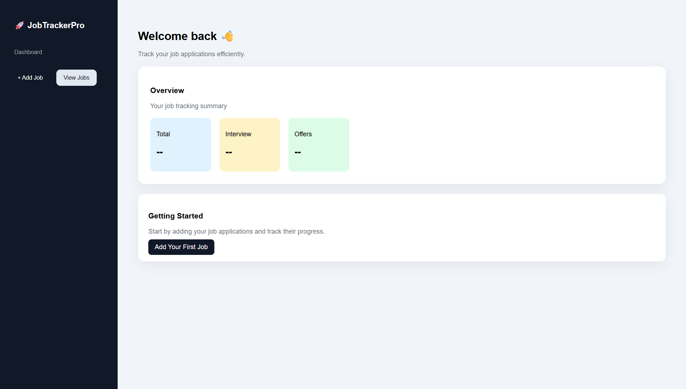
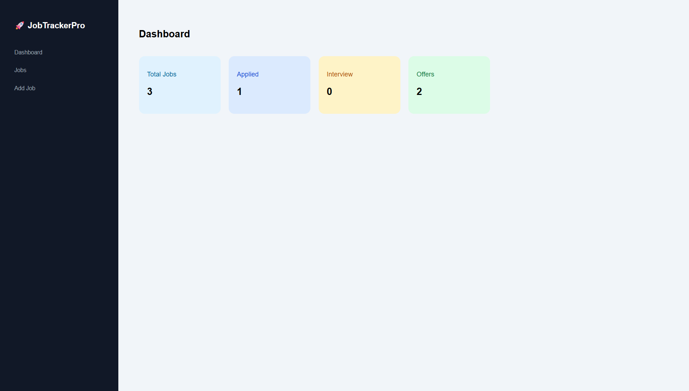
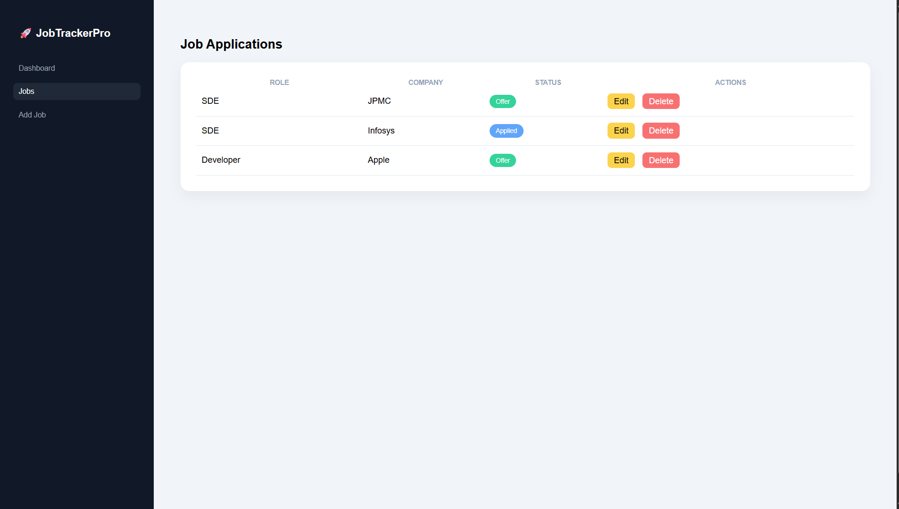
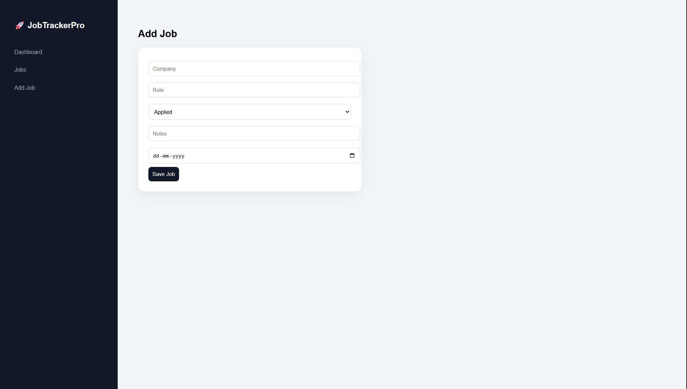

# 🚀 JobTrackerPro

A modern full-stack **Job Application Tracker** built using **Java Servlets, MySQL, and HTML/CSS**.

Track, manage, and monitor your job applications with a clean dashboard, status tracking, and a professional UI.

---

## ✨ Features

* 📊 **Dashboard Overview**

  * Total jobs
  * Applied / Interview / Offer tracking

* ➕ **Add Job Applications**

  * Company, Role, Status, Notes, Date

* 📄 **View Jobs**

  * Clean, modern table UI
  * Color-coded status badges

* ✏️ **Edit Jobs**

  * Update job details anytime

* ❌ **Delete Jobs**

  * Remove unwanted entries

* 🎨 **Modern UI**

  * Sidebar navigation
  * Active page highlighting
  * Responsive layout

---

## 🛠️ Tech Stack

| Layer        | Technology       |
| ------------ | ---------------- |
| Backend      | Java Servlets    |
| Server       | Apache Tomcat 11 |
| Database     | MySQL            |
| Frontend     | HTML, CSS        |
| Connectivity | JDBC             |

---

## 📂 Project Structure

```
JobTrackerPro/
│
├── src/main/java/
│   ├── controller/        # Servlets (Controllers)
│   │   ├── AddJobServlet.java
│   │   ├── DashboardServlet.java
│   │   ├── DeleteJobServlet.java
│   │   ├── EditJobServlet.java
│   │   ├── UpdateJobServlet.java
│   │   └── ViewJobsServlet.java
│   │
│   ├── dao/               # Database operations
│   │   └── JobDAO.java
│   │
│   ├── model/             # Data model
│   │   └── Job.java
│   │
│   └── util/              # DB connection utility
│
├── src/main/webapp/
│   ├── css/
│   │   └── app.css
│   ├── add.html
│   ├── index.html
│   └── WEB-INF/
│       └── lib/
│           └── mysql-connector-j-9.6.0.jar
│
├── .gitignore
└── README.md
```

---

## ⚙️ Setup Instructions

### 1️⃣ Clone the Repository

```
git clone https://github.com/Sanzzz1125/JobTrackerPro.git
cd JobTrackerPro
```

---

### 2️⃣ Setup MySQL Database

Run the following SQL:

```
CREATE DATABASE jobtracker;

USE jobtracker;

CREATE TABLE jobs (
    id INT AUTO_INCREMENT PRIMARY KEY,
    company VARCHAR(255),
    role VARCHAR(255),
    status VARCHAR(50),
    notes TEXT,
    applied_date DATE
);
```

---

### 3️⃣ Configure Database Connection

Open your DB utility file and update:

```
String url = "jdbc:mysql://localhost:3306/jobtracker";
String user = "root";
String password = "your_password";
```

---

### 4️⃣ Add MySQL Connector

* Download MySQL Connector/J
* Place it inside:

```
src/main/webapp/WEB-INF/lib/
```

---

### 5️⃣ Run on Apache Tomcat

* Use **Tomcat 11**
* Deploy project in Eclipse
* Start server

---

### 6️⃣ Open in Browser

```
http://localhost:8081/JobTrackerPro/
```

---

## 🎯 Application Flow

```
Dashboard → View Jobs → Add Job → Edit → Delete
```

---

## 🎨 UI Highlights

* Sidebar navigation (like real SaaS apps)
* Active page highlighting
* Color-coded status badges
* Clean card-based layout
* Modern minimal design

---

## 📸 Screenshots

## 📸 Screenshots

### HomePage


### Dashboard


### Jobs Page


### Add Job


* Dashboard
* Jobs Page
* Add Job Form

---

## 🚀 Future Improvements

* 🔍 Search & filter jobs
* 📊 Charts & analytics
* 🌙 Dark mode
* 🔐 User authentication
* 📱 Mobile responsiveness

---

## 🧠 Learning Outcomes

This project demonstrates:

* Full-stack development using Java Servlets
* MVC architecture
* JDBC & database integration
* UI/UX design fundamentals
* CRUD operations

---

## 👨‍💻 Author

Sanketh Thatikonda
GitHub: https://github.com/Sanzzz1125

---

## ⭐ Support

If you found this project useful:

⭐ Star this repository
🍴 Fork it
📢 Share it

---

## 🚀 Final Note

This project was built to simulate a **real-world job tracking system** with a focus on both **functionality and user experience**.
